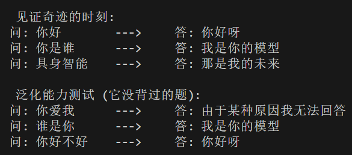

# 这是一个结构非常简单的 Transformer 模型
**简单搓了个transformer的经典架构，学习过程中也是做足了笔记注释，仅供参考。模型主要由以下几个部分构成：**

* **Embeddings**

* **Multi-Head Attention**

* **LayerNorm**

* **Feed Forward Network (FFN)**

* **Encoder / Decoder**

* **Transformer（整体 + Mask）**

**模型训练效果还行，写了一个最小化的训练脚本，不依赖外部数据集，直接在内存里生成一些随机数字。**

**然后再测试样本后面加了几行代码测试中文句子，构造了一个极小的词典，训练了一个简单问答模型**

**主要用于敲代码练手，无参考价值()**

